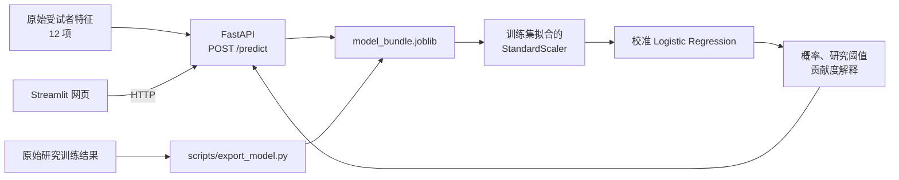

# PPMI Rapid Subtype Prediction Demo

一个将 PPMI 队列研究中的 Logistic Regression 模型封装为 AI 应用的学习项目。它提供了从原始特征输入、模型推理、概率校准与贡献度解释，到 HTTP API 和网页交互的一条完整链路。

> **定位：** 这是科研复现与 AI 工程学习演示，**不是**临床诊断工具，也不应据此作出医疗决策。

## AI 应用亮点

- **模型服务化：** 将训练流程导出的 `StandardScaler`、基础 Logistic Regression 和 sigmoid 校准模型打包为单个 `joblib` 工件；
- **前后端解耦：** FastAPI 负责模型推理，Streamlit 网页仅通过 HTTP 调用 `/predict`，不重复加载或计算模型；
- **可靠输入契约：** 后端使用 Pydantic 校验 12 项原始特征；缺字段时返回可读的 `422` 错误；
- **可解释输出：** 返回校准后的 Rapid 概率、研究阈值、全部特征的线性贡献度及正负 Top 3；
- **工程质量：** 使用 `unittest` 覆盖模型导出、预测、输入校验、API 与网页请求辅助函数。

## 系统架构



## 项目结构

```text
app/
  predictor.py          输入校验、标准化、预测与特征贡献度计算
  api.py                FastAPI：/health 与 /predict
artifacts/              本地模型工件 model_bundle.joblib（不提交 Git）
examples/
  sample_patient.json   12 项特征的演示输入
scripts/
  export_model.py       从研究训练输出创建模型工件
tests/                  自动化测试
ui/
  dashboard.py          Streamlit 预测网页，只调用 FastAPI
docs/                   设计与实现计划
```

## 技术栈

- Python 3.9+
- scikit-learn：`StandardScaler`、Logistic Regression、sigmoid 概率校准
- FastAPI + Uvicorn：推理 API 与自动 Swagger 文档
- Streamlit：本地预测网页
- pandas、joblib、unittest、Git/GitHub

## 快速启动（Windows / Conda）

以下示例使用本项目开发时的 Conda 环境。首次运行先安装依赖：

```powershell
cd "C:\Users\20284\Desktop\方案\product_demo"
& "C:\Users\20284\anaconda3\envs\pd-mci\python.exe" -m pip install -r requirements.txt
```

### 1. 导出本地模型工件

`model_bundle.joblib` 不上传 GitHub；它由本地的研究训练结果生成：

```powershell
& "C:\Users\20284\anaconda3\envs\pd-mci\python.exe" scripts\export_model.py
```

成功后会生成 `artifacts/model_bundle.joblib`。其中保存了训练集上 `fit` 的标准化器、基础模型、校准模型、特征顺序和研究阈值。

### 2. 启动 FastAPI 后端

在**第一个终端**运行：

```powershell
cd "C:\Users\20284\Desktop\方案\product_demo"
& "C:\Users\20284\anaconda3\envs\pd-mci\python.exe" -m uvicorn app.api:app --reload
```

看到 `Uvicorn running on http://127.0.0.1:8000` 后，浏览器打开 [http://127.0.0.1:8000/docs](http://127.0.0.1:8000/docs)。

### 3. 启动 Streamlit 网页

保持后端终端运行，并在**第二个终端**运行：

```powershell
cd "C:\Users\20284\Desktop\方案\product_demo"
& "C:\Users\20284\anaconda3\envs\pd-mci\python.exe" -m streamlit run ui/dashboard.py
```

浏览器打开 [http://127.0.0.1:8501](http://127.0.0.1:8501)。点击“加载示例数据”后可直接提交预测。

## API 契约

| 方法 | 路径 | 用途 |
| --- | --- | --- |
| `GET` | `/health` | 查看服务状态、模型文件是否存在、特征数 |
| `POST` | `/predict` | 提交一名受试者的 12 项原始特征并获得预测结果 |

`POST /predict` 需要的字段为：`scopa`、`NP1COG`、`rem`、`DVT_SFTANIM`、`MIA_STRIATUM_mean`、`LEDD`、`SEX`、`updrs3_score`、`MSEADLG`、`DVT_SDM`、`upsit_pctl`、`quip`；`patient_id` 为可选字段。完整示例见 [`examples/sample_patient.json`](examples/sample_patient.json)。

返回内容包含：

- `rapid_probability`：经过 sigmoid 校准后的 Rapid 亚型概率；
- `research_threshold`：原研究交叉验证流程得到的研究阈值；
- `prediction_label`：相对该研究阈值的演示标签；
- `all_feature_contributions`：按固定特征顺序计算的线性贡献度；
- `top_positive_contributors` / `top_negative_contributors`：贡献度最大的正、负向特征。

若缺少特征或格式不正确，接口返回 `422`；若尚未导出本地模型工件，接口返回 `503`。网页会将这两类错误转成中文提示。

## 运行测试

在项目根目录运行：

```powershell
& "C:\Users\20284\anaconda3\envs\pd-mci\python.exe" -m unittest discover -s tests -v
```

测试覆盖模型工件导出、原始 JSON 预测、缺字段校验、API 健康检查与预测、网页请求载荷构造及错误提示。

## 结果如何理解

`rapid_probability` 是校准模型给出的概率，不等于诊断结论。 `contribution` 是标准化后的特征值乘以基础 Logistic Regression 系数得到的**线性得分贡献**，用于解释模型为何倾向某个输出；它不是因果效应，也不代表临床重要性。

## 面试时可以如何介绍

> 我将一个科研场景下的 Logistic Regression 模型做成了可运行的 AI 应用：把训练集拟合的标准化器、基础模型和校准模型封装成 `joblib` 工件，用 FastAPI 提供带输入校验的推理接口，再用 Streamlit 通过 HTTP 调用接口展示概率和特征贡献度。项目用 Git 分支管理功能开发，并为模型、API 和网页核心逻辑补充了自动化测试。

你还可以主动说明两个工程取舍：模型文件不提交到 Git，以避免二进制工件混入源码；网页不直接调用模型，以保持 UI 与推理服务解耦，未来可替换为远程服务或容器部署。

## 免责声明

本项目仅用于科研复现与工程学习演示，不可用于临床诊断或医疗决策。

## Learning log

- 2026-09-14: Initialized the Git repository and pushed the project to GitHub.
- 2026-09-14: Practiced the Git command-line workflow.
- 2026-09-15: Added a FastAPI prediction service and Streamlit dashboard.
- 2026-09-15: Reworked the README as an AI application portfolio landing page.
