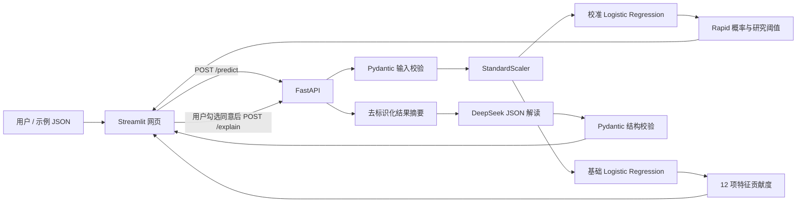

# PPMI Rapid Subtype Prediction Demo

一个将科研机器学习模型封装为可交互 AI 应用的端到端工程项目：本地 Logistic Regression 负责预测，FastAPI 提供服务，Streamlit 展示结果，DeepSeek 在用户明确同意后提供去标识化科研解读。

> 本项目仅用于科研复现与工程学习演示，不可用于临床诊断、治疗或医疗决策。

## 项目目标

这个项目解决的不是“再训练一个模型”，而是把已有研究流程整理成一个可验证、可调用、可解释、可排错的应用：

- 输入一位受试者的 12 项原始特征；
- 使用只在训练集上拟合的 `StandardScaler` 做标准化；
- 用 sigmoid 校准后的 Logistic Regression 输出 Rapid 亚型概率；
- 用基础 Logistic Regression 的 `标准化特征 × 系数` 展示样本级贡献度；
- 通过 FastAPI、Streamlit 和可选 DeepSeek 解读形成完整应用链路；
- 用结构化输出校验、请求编号、环境变量和自动化测试保证工程可靠性。

## 项目亮点

- **预测与解释职责分离**：校准模型负责概率，基础模型负责线性贡献度，DeepSeek 不参与分类。
- **原始输入契约**：网页和 API 接收 12 项原始值，标准化器随模型一起打包，避免手工预处理不一致。
- **结构化 LLM 输出**：DeepSeek 必须返回固定 JSON，本地 Pydantic 再校验字段、类型和非空内容。
- **隐私最小化**：外部 LLM 不接收 `patient_id` 或 12 项原始特征，只接收去标识化模型结果摘要。
- **可观测性**：API 为每次请求生成 `request_id`，记录路径、状态码和耗时，不记录密钥或原始数据。
- **可配置与可测试**：模型路径、API 地址和 DeepSeek 模型通过环境变量切换；完整测试覆盖预测、API、网页、LLM 边界和配置。

## 系统架构



核心数据流：

```text
原始特征 → 训练集标准化器 → 校准模型概率
                         ↘ 基础模型贡献度
概率/阈值/Top 贡献摘要 → 可选 DeepSeek 解读 → JSON 校验 → 分区展示
```

## 目录说明

```text
app/
  api.py             FastAPI 接口、请求编号、统一错误响应
  deepseek.py        去标识化提示词、DeepSeek 调用、JSON/Pydantic 校验
  predictor.py       原始输入校验、标准化、概率预测、贡献度计算
  settings.py        环境变量与安全默认配置
ui/
  dashboard.py       Streamlit 交互网页
scripts/
  export_model.py    从授权研究 CSV 导出模型包
examples/
  sample_patient.json  非敏感演示输入
tests/               自动化测试
docs/
  demo-runbook.md    本地演示与排错流程
  project-presentation.md  1 分钟/3 分钟项目讲解稿
artifacts/           本地模型文件，不提交 Git
outputs/             本地预测结果，不提交 Git
```

## 运行条件与数据边界

- Python 3.9+
- Windows PowerShell（命令示例使用 PowerShell）
- 依赖见 `requirements.txt`
- 导出模型需要合法持有以下研究派生文件：
  - `PPMI_4_LASSO_train_raw.csv`
  - `PPMI_4_LASSO_train_1se.csv`

训练 CSV 和 `model_bundle.joblib` 不包含在仓库中。没有授权源文件的访客可以审查代码、接口、测试和架构，但不能从本仓库独立重建相同研究模型。

## 快速启动

### 1. 克隆并安装依赖

```powershell
git clone https://github.com/xia510/ppmi-rapid-subtype-prediction-demo.git
cd ppmi-rapid-subtype-prediction-demo
python -m pip install -r requirements.txt
```

### 2. 导出模型包

将 `--source-root` 替换为你获授权使用的研究文件目录：

```powershell
python scripts/export_model.py `
  --source-root "C:\path\to\authorized\research-data" `
  --artifact "artifacts\model_bundle.joblib"
```

成功后应看到：

```text
Model bundle saved to: artifacts\model_bundle.joblib
```

### 3. 启动 FastAPI（终端 1）

DeepSeek 解读是可选功能。仅在需要时，在启动 FastAPI 的同一个终端设置密钥：

```powershell
$env:DEEPSEEK_API_KEY = "你的 DeepSeek API Key"
$env:DEEPSEEK_MODEL = "deepseek-flash"
python -m uvicorn app.api:app --reload
```

检查：

- 健康状态：`http://127.0.0.1:8000/health`
- Swagger 文档：`http://127.0.0.1:8000/docs`

### 4. 启动 Streamlit（终端 2）

```powershell
python -m streamlit run ui/dashboard.py
```

打开 `http://127.0.0.1:8501`，加载示例数据并点击“开始预测”。只有勾选外部 API 调用说明并点击“生成 DeepSeek 辅助解读”时，才会调用 DeepSeek。

更完整的演示步骤、预期结果和排错方法见 [本地演示手册](docs/demo-runbook.md)。

## API 说明

| 方法 | 路径 | 作用 | 是否调用外部服务 |
|---|---|---|---|
| `GET` | `/health` | 服务状态、特征数量、模型文件是否可用 | 否 |
| `POST` | `/predict` | 返回校准概率、研究阈值和全部贡献度 | 否 |
| `POST` | `/explain` | 本地重新预测后请求去标识化 DeepSeek 解读 | 是 |

`POST /predict` 和 `POST /explain` 都接收同一组 12 项原始特征。示例请求见 `examples/sample_patient.json`。

典型预测结果包含：

```json
{
  "rapid_probability": 0.087,
  "research_threshold": 0.2092,
  "prediction_label": "Rapid risk below research threshold",
  "top_positive_contributors": [],
  "top_negative_contributors": [],
  "all_feature_contributions": []
}
```

所有响应头都包含 `X-Request-ID`。预期错误采用稳定结构：

```json
{
  "error": {
    "code": "deepseek_not_configured",
    "message": "DeepSeek API key is not configured."
  },
  "request_id": "a1b2c3d4e5f6"
}
```

## 模型与解释边界

- `rapid_probability` 来自 sigmoid 校准模型，用于提高概率解释的一致性；
- `research_threshold` 是原研究流程得到的演示阈值，不是临床诊断界值；
- `contribution = standardized_value × coefficient`，只描述该基础逻辑回归模型的线性得分；
- 正向贡献提高线性得分，负向贡献降低线性得分；
- 贡献度不是因果效应，也不等同于特征重要性的普遍结论；
- DeepSeek 只把已有模型结果转述为中文，不重新计算概率、不改变标签。

## 隐私与安全边界

发送给 DeepSeek 的内容仅包括：概率、研究阈值、研究标签、模型版本和 Top 正负贡献摘要。

不会发送：

- `patient_id`；
- 12 项原始特征值；
- API Key；
- 完整模型文件或训练数据。

DeepSeek 输出必须是三个非空字段：`probability_summary`、`contribution_summary`、`research_disclaimer`。非 JSON、缺字段、空内容或额外字段都会被后端拒绝。真实 `.env`、模型包、预测输出和 Git 工作区均已通过 `.gitignore` 排除。

## 配置

`.env.example` 只用于说明变量名称，项目不会自动加载它。当前配置通过启动终端的环境变量传入：

| 变量 | 默认值 | 用途 |
|---|---|---|
| `DEEPSEEK_API_KEY` | 无 | 可选 DeepSeek 调用凭据 |
| `DEEPSEEK_MODEL` | `deepseek-flash` | DeepSeek 模型 |
| `PPMI_MODEL_ARTIFACT` | `artifacts/model_bundle.joblib` | 模型包路径 |
| `PPMI_API_BASE_URL` | `http://127.0.0.1:8000` | Streamlit 调用的 API 地址 |

## 测试

没有研究 CSV 时，可运行不依赖模型数据的测试；模型相关用例会显示为 skipped：

```powershell
python -m unittest discover -s tests -v
```

运行完整测试前，先将授权数据目录传给测试进程：

```powershell
$env:PPMI_TEST_SOURCE_ROOT = "C:\path\to\authorized\research-data"
python -m unittest discover -s tests -v
```

测试不会调用真实 DeepSeek，也不会消耗 API 余额。

## 常见问题

### 网页显示 `127.0.0.1 拒绝连接`

FastAPI 或 Streamlit 尚未启动，或端口与 `PPMI_API_BASE_URL` 不一致。确认两个终端都在运行，并分别访问 `/health` 和 `8501` 页面。

### `/health` 正常，但网页提示没有模型文件

先运行模型导出命令，确认 `artifacts/model_bundle.joblib` 存在；如果模型在其他位置，设置 `PPMI_MODEL_ARTIFACT` 后重启 FastAPI。

### `/explain` 返回 `503 deepseek_not_configured`

在启动 FastAPI 的同一个 PowerShell 窗口设置 `DEEPSEEK_API_KEY`，然后重启服务。不同终端的临时环境变量互不共享。

### `/explain` 返回 `502 deepseek_unavailable`

外部 DeepSeek 请求失败、超时或返回内容未通过 JSON/Pydantic 校验。稍后重试，并用网页给出的 `request_id` 对照 FastAPI 终端日志。

### `POST /predict` 返回 `422 invalid_input`

检查 12 项特征是否全部存在、是否为有限数值。FastAPI 的 `/docs` 页面可直接查看请求结构。

### LF/CRLF 警告是不是错误？

这是 Windows 与 Git 的换行格式提示，不代表提交或代码失败。

## 项目状态

当前版本已完成模型打包、命令行预测、FastAPI、Streamlit、样本级贡献度、DeepSeek 结构化解读、隐私边界、请求日志、配置管理与自动化测试。下一阶段可将相同工程方法迁移到 RAG 知识库问答项目。

## 免责声明

本仓库是科研复现与 AI 应用工程学习项目，不是经过临床验证、监管审批或生产部署的医疗器械。
