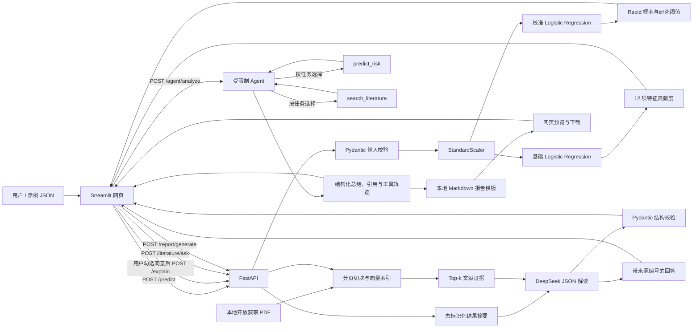

# PPMI Rapid Subtype Prediction Demo

一个将科研机器学习模型封装为可交互 AI 应用的端到端工程项目：本地 Logistic Regression 负责预测，FastAPI 提供服务，Streamlit 展示结果，DeepSeek 在用户明确同意后提供去标识化科研解读；本地医学文献 RAG 可以从自建 PDF 知识库检索证据，轻量 Agent 能按研究任务选择工具，并生成带已核验引用的可下载 Markdown 报告。

> 本项目仅用于科研复现与工程学习演示，不可用于临床诊断、治疗或医疗决策。

## 项目目标

这个项目解决的不是“再训练一个模型”，而是把已有研究流程整理成一个可验证、可调用、可解释、可排错的应用：

- 输入一位受试者的 12 项原始特征；
- 使用只在训练集上拟合的 `StandardScaler` 做标准化；
- 用 sigmoid 校准后的 Logistic Regression 输出 Rapid 亚型概率；
- 用基础 Logistic Regression 的 `标准化特征 × 系数` 展示样本级贡献度；
- 通过 FastAPI、Streamlit 和可选 DeepSeek 解读形成完整应用链路；
- 让受限制的 Agent 在白名单内选择本地预测或文献检索工具；
- 将 Agent 的结构化结果确定性渲染为带文献依据的 Markdown 科研报告；
- 用结构化输出校验、请求编号、环境变量和自动化测试保证工程可靠性。

## 项目亮点

- **预测与解释职责分离**：校准模型负责概率，基础模型负责线性贡献度，DeepSeek 不参与分类。
- **原始输入契约**：网页和 API 接收 12 项原始值，标准化器随模型一起打包，避免手工预处理不一致。
- **结构化 LLM 输出**：DeepSeek 必须返回固定 JSON，本地 Pydantic 再校验字段、类型和非空内容。
- **隐私最小化**：外部 LLM 不接收 `patient_id` 或 12 项原始特征，只接收去标识化模型结果摘要。
- **可观测性**：API 为每次请求生成 `request_id`，记录路径、状态码和耗时，不记录密钥或原始数据。
- **可配置与可测试**：模型路径、API 地址和 DeepSeek 模型通过环境变量切换；完整测试覆盖预测、API、网页、LLM 边界和配置。
- **回答有据可查**：RAG 只允许 DeepSeek 引用本次本地检索到的来源编号，网页同时显示文献名、页码、原文片段和相似度。
- **Agent 工具调用**：DeepSeek只负责选择 `predict_risk`、`search_literature` 和整理结果；本地代码校验参数、执行工具、限制调用次数并展示安全轨迹。
- **可下载科研报告**：Python 固定模板负责章节和引用排版，不让大模型自由生成整份报告；报告只使用 Agent 已核验的来源。

## 系统架构


```mermaid
flowchart LR
    U[用户 / 示例 JSON] --> UI[Streamlit 网页]
    UI -->|POST /predict| API[FastAPI]
    API --> V[Pydantic 输入校验]
    V --> S[StandardScaler]
    S --> C[校准 Logistic Regression]
    C --> P[Rapid 概率与研究阈值]
    S --> B[基础 Logistic Regression]
    B --> F[12 项特征贡献度]
    P --> UI
    F --> UI
    UI -->|用户勾选同意后 POST /explain| API
    API --> D[去标识化结果摘要]
    D --> L[DeepSeek JSON 解读]
    L --> J[Pydantic 结构校验]
    J --> UI
    PDF[本地开放获取 PDF] --> IDX[分页切块与向量索引]
    UI -->|POST /literature/ask| API
    API --> IDX
    IDX --> E[Top-k 文献证据]
    E --> L
    L --> R[带来源编号的回答]
    R --> UI
    UI -->|POST /agent/analyze| A[受限制 Agent]
    A -->|按任务选择| AT1[predict_risk]
    A -->|按任务选择| AT2[search_literature]
    AT1 --> A
    AT2 --> A
    A --> AR[结构化总结、引用与工具轨迹]
    AR --> UI
    UI -->|POST /report/generate| API
    AR --> MR[本地 Markdown 报告模板]
    MR --> DL[网页预览与下载]
    DL --> UI
```

核心数据流：

```text
原始特征 → 训练集标准化器 → 校准模型概率
                         ↘ 基础模型贡献度
概率/阈值/Top 贡献摘要 → 可选 DeepSeek 解读 → JSON 校验 → 分区展示
用户问题 → 本地向量检索 → Top-k PDF 片段 → DeepSeek 基于证据回答 → 引用校验与展示
研究任务 → Agent 选择白名单工具 → 本地执行 → 脱敏观察结果 → 最终 JSON 与工具轨迹
报告任务 → 已校验 Agent 结果 → 本地固定 Markdown 模板 → 预览与下载
```

## 目录说明

```text
app/
  agent.py           Agent 工具白名单、有限循环、隐私投影和引用校验
  api.py             FastAPI 接口、请求编号、统一错误响应
  deepseek.py        去标识化提示词、DeepSeek 调用、JSON/Pydantic 校验
  predictor.py       原始输入校验、标准化、概率预测、贡献度计算
  report.py          校验 Agent 结果并生成固定结构的 Markdown 报告
  settings.py        环境变量与安全默认配置
ui/
  dashboard.py       Streamlit 交互网页
scripts/
  export_model.py    从授权研究 CSV 导出模型包
  build_literature_index.py  从本地 PDF 构建文献向量索引
knowledge_base/
  source_documents/  本地文献 PDF，不提交 Git
  index/             自动生成的向量与元数据，不提交 Git
examples/
  sample_patient.json  非敏感演示输入
tests/               自动化测试
docs/
  demo-runbook.md    本地演示与排错流程
  project-presentation.md  1 分钟/3 分钟项目讲解稿
artifacts/           本地模型文件，不提交 Git
outputs/             本地预测结果，不提交 Git
```

## 运行条件与数据边界

- Python 3.9+
- Windows PowerShell（命令示例使用 PowerShell）
- 依赖见 `requirements.txt`
- 导出模型需要合法持有以下研究派生文件：
  - `PPMI_4_LASSO_train_raw.csv`
  - `PPMI_4_LASSO_train_1se.csv`

训练 CSV 和 `model_bundle.joblib` 不包含在仓库中。没有授权源文件的访客可以审查代码、接口、测试和架构，但不能从本仓库独立重建相同研究模型。

## 快速启动

### Windows 一键启动（推荐）

在项目根目录双击 `start_demo.bat`。首次运行时会在终端中提示输入 DeepSeek API Key，并保存到本机 `.env`；之后再次双击即可直接启动 FastAPI 和 Streamlit，并自动打开网页。

停止服务时双击 `stop_demo.bat`。本机 `.runtime\` 只保存一键停止所需的进程记录；`.env` 和运行记录均已被 Git 忽略，不会上传 GitHub。

也可以在 PowerShell 中运行：

```powershell
.\scripts\start_demo.ps1
```

```powershell
.\scripts\stop_demo.ps1
```

如果 8000 或 8501 端口已被以前手工启动的服务占用，请先到对应终端按 `Ctrl+C`；一键停止脚本只会停止由一键启动脚本记录的进程，不会任意结束其他程序。

### 1. 克隆并安装依赖

```powershell
git clone https://github.com/xia510/ppmi-rapid-subtype-prediction-demo.git
cd ppmi-rapid-subtype-prediction-demo
python -m pip install -r requirements.txt
```

首次使用 RAG 时会下载约百兆级的 `BAAI/bge-small-zh-v1.5` 向量模型并缓存在用户目录；这不是另一个桌面软件，后续可离线加载。Windows 的 Hugging Face 符号链接警告不影响运行，只表示缓存可能多占一些磁盘空间。

### 2. 构建医学文献知识库（使用 RAG 时需要）

只将你有权使用的开放获取 PDF 放入 `knowledge_base\source_documents\`，然后运行：

```powershell
python scripts\build_literature_index.py
```

脚本会逐页提取文字、重叠切块、生成向量，并写入 `knowledge_base\index\`。替换、增加或删除 PDF 后需要重新执行。PDF 和索引默认不提交 Git，详细规则见 [知识库说明](knowledge_base/README.md)。

### 3. 导出模型包

将 `--source-root` 替换为你获授权使用的研究文件目录：

```powershell
python scripts/export_model.py `
  --source-root "C:\path\to\authorized\research-data" `
  --artifact "artifacts\model_bundle.joblib"
```

成功后应看到：

```text
Model bundle saved to: artifacts\model_bundle.joblib
```

### 4. 启动 FastAPI（终端 1）

DeepSeek 解读是可选功能。仅在需要时，在启动 FastAPI 的同一个终端设置密钥：

```powershell
$env:DEEPSEEK_API_KEY = "你的 DeepSeek API Key"
$env:DEEPSEEK_MODEL = "deepseek-flash"
python -m uvicorn app.api:app --reload
```

检查：

- 健康状态：`http://127.0.0.1:8000/health`
- Swagger 文档：`http://127.0.0.1:8000/docs`

### 5. 启动 Streamlit（终端 2）

```powershell
python -m streamlit run ui/dashboard.py
```

打开 `http://127.0.0.1:8501`，加载示例数据并点击“开始预测”。只有勾选外部 API 调用说明并主动点击相应按钮时，才会调用 DeepSeek。预测完成后可以运行“Agent 智能分析”，或在“带文献依据的最终报告”区域生成、预览和下载 Markdown；页面下方的“帕金森病医学文献助手”仍可独立回答一般性科研问题。

更完整的演示步骤、预期结果和排错方法见 [本地演示手册](docs/demo-runbook.md)。

## API 说明

| 方法 | 路径 | 作用 | 是否调用外部服务 |
|---|---|---|---|
| `GET` | `/health` | 服务状态、特征数量、模型文件是否可用 | 否 |
| `POST` | `/predict` | 返回校准概率、研究阈值和全部贡献度 | 否 |
| `POST` | `/explain` | 本地重新预测后请求去标识化 DeepSeek 解读 | 是 |
| `POST` | `/literature/ask` | 从本地 PDF 检索证据并生成带引用回答 | 是 |
| `POST` | `/agent/analyze` | 让 Agent 选择本地预测/检索工具并返回结构化研究结果 | 是 |
| `POST` | `/report/generate` | 运行 Agent 并把已校验结果渲染为可下载 Markdown 报告 | 是 |

`POST /predict` 和 `POST /explain` 都接收同一组 12 项原始特征。示例请求见 `examples/sample_patient.json`。

典型预测结果包含：

```json
{
  "rapid_probability": 0.087,
  "research_threshold": 0.2092,
  "prediction_label": "Rapid risk below research threshold",
  "top_positive_contributors": [],
  "top_negative_contributors": [],
  "all_feature_contributions": []
}
```

所有响应头都包含 `X-Request-ID`。预期错误采用稳定结构：

```json
{
  "error": {
    "code": "deepseek_not_configured",
    "message": "DeepSeek API key is not configured."
  },
  "request_id": "a1b2c3d4e5f6"
}
```

## 最终报告与引用边界

`POST /report/generate` 接收与 `/agent/analyze` 相同的患者输入、研究问题和 1～5 的 `top_k`。后端先运行受限制 Agent，再由 `app/report.py` 本地生成固定的七个报告章节。返回值包括安全文件名、Markdown、引用数量、工具轨迹、提供方和模型名。

报告生成器不会从 DeepSeek 的自由文本里猜测参考文献，也不会接受网页自行拼接的引用。它只遍历本次 Agent 已检索并通过 `source_id` 校验的 `citations`，因此报告格式稳定，引用来源也可以回到本地 PDF 页码核对。报告不包含 12 项原始特征，且始终保留科研用途声明。

## 模型与解释边界

- `rapid_probability` 来自 sigmoid 校准模型，用于提高概率解释的一致性；
- `research_threshold` 是原研究流程得到的演示阈值，不是临床诊断界值；
- `contribution = standardized_value × coefficient`，只描述该基础逻辑回归模型的线性得分；
- 正向贡献提高线性得分，负向贡献降低线性得分；
- 贡献度不是因果效应，也不等同于特征重要性的普遍结论；
- DeepSeek 只把已有模型结果转述为中文，不重新计算概率、不改变标签。

## 隐私与安全边界

预测解读与 Agent 发送给 DeepSeek 的患者相关内容仅包括：概率、研究阈值、研究标签、模型版本和 Top 正负贡献摘要。Agent 还可能发送用户填写的研究问题，以及本次本地检索得到的文献片段。

不会发送：

- `patient_id`；
- 12 项原始特征值；
- API Key；
- 完整模型文件或训练数据。

文献问答会向 DeepSeek 发送“用户问题 + 本次检索出的 Top-k 文献片段及来源编号”。不要在问题中填写姓名、身份证号、联系方式、病历号或其他可识别个人的信息。DeepSeek 返回的引用编号若不在本次检索结果中，后端会拒绝该回答。

Agent 只能调用 `predict_risk` 和 `search_literature`。未知工具、非法参数、完全相同的重复调用、第五次工具调用，以及引用本次未检索来源的结果都会被后端拒绝。网页展示的工具轨迹只有工具名和成功状态，不包含患者原始值。

DeepSeek 输出必须是三个非空字段：`probability_summary`、`contribution_summary`、`research_disclaimer`。非 JSON、缺字段、空内容或额外字段都会被后端拒绝。真实 `.env`、模型包、预测输出和 Git 工作区均已通过 `.gitignore` 排除。

## 配置

`.env.example` 只用于说明变量名称，项目不会自动加载它。当前配置通过启动终端的环境变量传入：

| 变量 | 默认值 | 用途 |
|---|---|---|
| `DEEPSEEK_API_KEY` | 无 | 可选 DeepSeek 调用凭据 |
| `DEEPSEEK_MODEL` | `deepseek-flash` | DeepSeek 模型 |
| `PPMI_MODEL_ARTIFACT` | `artifacts/model_bundle.joblib` | 模型包路径 |
| `PPMI_API_BASE_URL` | `http://127.0.0.1:8000` | Streamlit 调用的 API 地址 |
| `PPMI_LITERATURE_INDEX` | `knowledge_base/index` | 本地文献向量索引目录 |

## 测试

没有研究 CSV 时，可运行不依赖模型数据的测试；模型相关用例会显示为 skipped：

```powershell
python -m unittest discover -s tests -v
```

运行完整测试前，先将授权数据目录传给测试进程：

```powershell
$env:PPMI_TEST_SOURCE_ROOT = "C:\path\to\authorized\research-data"
python -m unittest discover -s tests -v
```

测试不会调用真实 DeepSeek，也不会消耗 API 余额。

## 常见问题

### 网页显示 `127.0.0.1 拒绝连接`

FastAPI 或 Streamlit 尚未启动，或端口与 `PPMI_API_BASE_URL` 不一致。确认两个终端都在运行，并分别访问 `/health` 和 `8501` 页面。

### `/health` 正常，但网页提示没有模型文件

先运行模型导出命令，确认 `artifacts/model_bundle.joblib` 存在；如果模型在其他位置，设置 `PPMI_MODEL_ARTIFACT` 后重启 FastAPI。

### `/explain` 返回 `503 deepseek_not_configured`

在启动 FastAPI 的同一个 PowerShell 窗口设置 `DEEPSEEK_API_KEY`，然后重启服务。不同终端的临时环境变量互不共享。

### `/explain` 返回 `502 deepseek_unavailable`

外部 DeepSeek 请求失败、超时或返回内容未通过 JSON/Pydantic 校验。稍后重试，并用网页给出的 `request_id` 对照 FastAPI 终端日志。

### 文献助手提示“知识库尚未建立”

确认 PDF 已放入 `knowledge_base\source_documents\`，运行 `python scripts\build_literature_index.py`，然后重启 FastAPI。`/health` 中的 `literature_index_available` 应为 `true`。

### 新增文献后为什么搜不到？

索引不会自动监控文件夹。新增、替换或删除 PDF 后重新运行建库脚本，随后重启 FastAPI。

### RAG 回答是否等于医学结论？

不是。它只是对有限本地语料的检索与归纳，可能漏检、误解或受文献质量影响；相似度也不代表证据等级。它不构成临床诊断、治疗或个体医疗建议。

### `POST /predict` 返回 `422 invalid_input`

检查 12 项特征是否全部存在、是否为有限数值。FastAPI 的 `/docs` 页面可直接查看请求结构。

### LF/CRLF 警告是不是错误？

这是 Windows 与 Git 的换行格式提示，不代表提交或代码失败。

## 项目状态

当前版本已完成模型打包、命令行预测、FastAPI、Streamlit、样本级贡献度、DeepSeek 结构化解读、本地 PDF 文献 RAG、带页码引用校验、Agent 工具调用、隐私边界、请求日志、配置管理与自动化测试。下一阶段可在这些结构化结果之上生成可下载的带文献依据最终报告。

## 免责声明

本仓库是科研复现与 AI 应用工程学习项目，不是经过临床验证、监管审批或生产部署的医疗器械。
