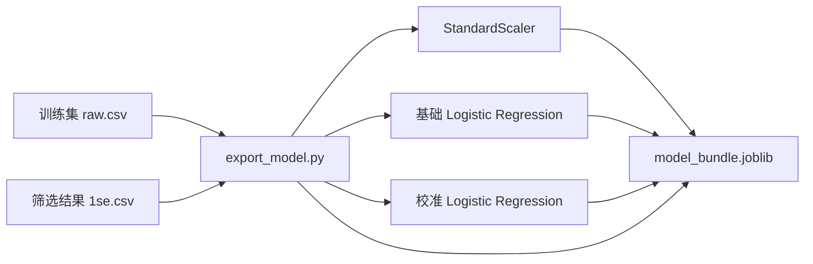
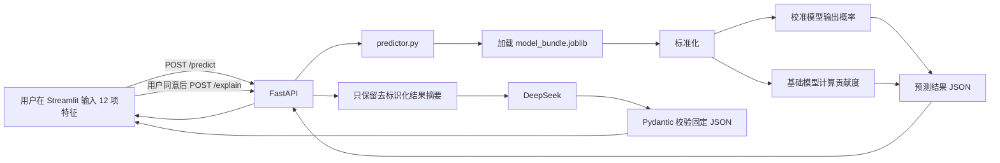

# 理解项目：从科研模型到 AI 应用

> 项目：PPMI Rapid Subtype Prediction Demo  
> 目标读者：正在学习 Python、机器学习工程、FastAPI、Streamlit 和大模型 API 的初学者  
> 项目边界：仅用于科研复现与工程学习，不用于临床诊断、治疗或医疗决策

## 1. 先用一句话理解这个项目

这个项目把一个已经确定好特征和参数的逻辑回归研究模型，包装成了一个可以在网页输入数据、通过后端预测、查看特征贡献，并可选择让 DeepSeek 用中文解释结果的完整 AI 应用。

它不是“让 DeepSeek 预测疾病”。真正负责数值预测的是本地的机器学习模型；DeepSeek 只负责把已经得到的模型结果转述成人更容易理解的中文。

## 2. 建议怎样阅读这份文档

第一次阅读时，先掌握主线，不必记住每行代码：

1. 先看第 3～5 节，弄清目录、模型导出和预测流程；
2. 再看第 6～9 节，弄清 FastAPI、Streamlit 和 DeepSeek 怎样串联；
3. 然后看第 10～12 节，理解配置、测试和排错；
4. 最后完成第 15 节的自测题和动手练习。

读代码时始终问五个问题：

1. 这个文件负责什么？
2. 它接收什么输入？
3. 它调用了谁？
4. 它返回什么输出？
5. 下一个文件怎样使用它的输出？

## 3. 项目全景

### 3.1 目录结构

```text
product_demo/
├─ app/
│  ├─ __init__.py
│  ├─ settings.py
│  ├─ predictor.py
│  ├─ api.py
│  └─ deepseek.py
├─ ui/
│  ├─ __init__.py
│  └─ dashboard.py
├─ scripts/
│  └─ export_model.py
├─ examples/
│  └─ sample_patient.json
├─ tests/
│  ├─ data_support.py
│  ├─ test_export_model.py
│  ├─ test_predictor.py
│  ├─ test_api.py
│  ├─ test_deepseek.py
│  ├─ test_dashboard.py
│  └─ test_settings.py
├─ docs/
│  ├─ demo-runbook.md
│  ├─ project-presentation.md
│  └─ plans/、superpowers/plans/
├─ artifacts/                  # 运行导出脚本后产生，不提交 Git
│  └─ model_bundle.joblib
├─ outputs/                    # 命令行预测结果，不提交 Git
├─ .env.example
├─ .gitignore
├─ requirements.txt
├─ README.md
└─ 理解项目.md
```

### 3.2 每个目录的职责

| 目录/文件 | 主要职责 | 与谁联系 |
|---|---|---|
| `scripts/export_model.py` | 读取训练 CSV，训练并打包模型 | 生成 `model_bundle.joblib`，供 `predictor.py` 使用 |
| `app/predictor.py` | 校验一个样本、标准化、预测、计算贡献度 | 被命令行和 `api.py` 调用 |
| `app/api.py` | 把 Python 预测函数包装成 HTTP 接口 | 接收 `dashboard.py` 请求，调用 `predictor.py` 和 `deepseek.py` |
| `app/deepseek.py` | 构造去标识化请求、调用 DeepSeek、校验 JSON | 被 `api.py` 的 `/explain` 调用 |
| `app/settings.py` | 集中读取模型路径、API 地址等配置 | 被 `api.py` 和 `dashboard.py` 调用 |
| `ui/dashboard.py` | 网页表单、结果展示、用户交互 | 只通过 HTTP 调用 FastAPI，不直接加载模型 |
| `examples/sample_patient.json` | 一份可公开使用的演示输入 | 命令行预测和网页“加载示例数据”使用 |
| `tests/` | 自动验证每一层仍按预期工作 | 分别覆盖导出、预测、API、LLM、网页辅助函数和配置 |
| `README.md` | 面向仓库访客的快速介绍和启动说明 | 是项目首页，不负责逐行教学 |
| `docs/demo-runbook.md` | 面试或演示时的操作脚本 | 告诉你按什么顺序启动和展示 |
| `docs/project-presentation.md` | 1 分钟、3 分钟讲解稿和面试问答 | 帮助把技术实现讲清楚 |

### 3.3 两条最重要的流程

整个项目包含一条“准备模型”流程和一条“使用模型”流程。

#### 流程 A：只需在模型准备阶段执行



#### 流程 B：每次用户预测时执行



这里最重要的分层思想是：

- `export_model.py` 负责准备可复用的模型包；
- `predictor.py` 负责机器学习计算；
- `api.py` 负责服务和边界；
- `dashboard.py` 负责交互和展示；
- `deepseek.py` 负责受限制的语言解释。

任何一层都没有包办全部工作，因此代码更容易测试、替换和排错。

## 4. 第一步：研究数据怎样变成模型包

### 4.1 两个 CSV 的区别

模型导出依赖仓库外、你获授权使用的两个文件：

- `PPMI_4_LASSO_train_raw.csv`：包含训练样本的原始数值和更多原始列，是拟合标准化器和模型时真正取值的数据来源；
- `PPMI_4_LASSO_train_1se.csv`：表示经过 LASSO 1SE 规则筛选后保留下来的列，本项目主要用它确定“最终选择哪 12 项特征以及它们的顺序”。

可以把它们理解成：

```text
1se.csv 告诉程序“用哪些题”
raw.csv 告诉程序“每道题的训练数据是什么”
```

不能只随意交换两者，因为训练数值和特征选择承担的是不同职责。

### 4.2 `scripts/export_model.py` 的作用

这个文件是模型工程化的起点。它把训练阶段需要的所有对象一次性保存，避免预测时重新训练。

它的主要输入和输出是：

```text
输入：source_root 目录
      ├─ PPMI_4_LASSO_train_raw.csv
      └─ PPMI_4_LASSO_train_1se.csv

输出：artifacts/model_bundle.joblib
```

#### 常量区

```python
ID_COLUMN = "PATNO"
LABEL_COLUMN = "Target"
CLASSIFICATION_THRESHOLD = 0.20918217546039175
```

- `PATNO` 是样本标识列，不是预测特征；
- `Target` 是训练标签，`1` 表示 Rapid，`0` 表示 Slow，也不是输入特征；
- `CLASSIFICATION_THRESHOLD` 是研究流程得到的分类阈值。概率达到或超过它时，显示“高于研究阈值”。它不必等于常见的 `0.5`。

`MODEL_PARAMS` 保存逻辑回归的固定参数：

- `penalty="l2"`：使用 L2 正则化，限制系数过度变大；
- `solver="saga"`：选择逻辑回归优化算法；
- `C`：正则化强度的倒数；
- `class_weight="balanced"`：根据类别数量给少数类更高损失权重；
- `max_iter=10000`：允许优化器有足够迭代次数；
- `random_state=42`：尽量保证可复现。

#### 核心函数 `export_model_bundle(source_root, artifact_path)`

它可以拆成七步理解。

第一步，读取两个训练文件：

```python
raw_train = pd.read_csv(source_root / "PPMI_4_LASSO_train_raw.csv")
selected_train = pd.read_csv(source_root / "PPMI_4_LASSO_train_1se.csv")
```

第二步，从 `selected_train` 的列名中排除 ID 和标签，得到固定特征列表：

```python
feature_names = [
    column
    for column in selected_train.columns
    if column not in (ID_COLUMN, LABEL_COLUMN)
]
```

当前顺序为：

```text
scopa, NP1COG, rem, DVT_SFTANIM, MIA_STRIATUM_mean, LEDD,
SEX, updrs3_score, MSEADLG, DVT_SDM, upsit_pctl, quip
```

顺序非常重要。模型系数、标准化器的均值/标准差和输入数组都按位置对应。字段全有但顺序错了，也可能把某个值交给错误的系数。

第三步，从原始训练表按这个顺序取值和标签：

```python
X_raw = raw_train[feature_names]
y = raw_train[LABEL_COLUMN]
```

第四步，只在训练集上拟合标准化器：

```python
scaler = StandardScaler()
X = scaler.fit_transform(X_raw)
```

对特征 `x`，标准化可近似写成：

```text
z = (x - 训练集均值) / 训练集标准差
```

为什么必须保存这个 `scaler`？因为新样本只能使用训练集得到的均值和标准差做 `transform`。如果给每个新样本重新 `fit`，训练与预测的尺度就不一致，还可能产生数据泄漏。

第五步，训练基础模型：

```python
base_model = LogisticRegression(**MODEL_PARAMS)
base_model.fit(X, y)
```

基础模型保留直接可读取的 `coef_`。本项目用它计算每个特征对线性得分的贡献。

第六步，训练 sigmoid 校准模型：

```python
calibrated_model = CalibratedClassifierCV(
    estimator=clone(LogisticRegression(**MODEL_PARAMS)),
    method="sigmoid",
    cv=calibration_cv,
    ensemble=False,
    n_jobs=-1,
)
calibrated_model.fit(X, y)
```

这里的含义是：

- 内部估计器仍然是相同参数的逻辑回归；
- `StratifiedKFold` 让每折尽量保持类别比例；
- `method="sigmoid"` 学习原模型分数到校准概率的映射；
- `class_weight="balanced"` 和概率校准不是一回事。前者调整训练损失，后者改善概率数值与真实比例之间的对应关系。

这里校准器当前使用 5 折交叉验证，而模型包中的阈值说明是既有研究流程记录的“10 折交叉验证 F1 阈值中位数”。两者负责不同任务：5 折用于本次概率校准，阈值元数据记录分类界值的研究来源，不要把两个折数混为一谈。

第七步，把所有推理契约打包：

```python
bundle = {
    "feature_names": feature_names,
    "scaler": scaler,
    "base_model": base_model,
    "calibrated_model": calibrated_model,
    "model_version": "research-demo-v1",
    "target_definition": "1 = Rapid subtype, 0 = Slow subtype",
    "classification_threshold": CLASSIFICATION_THRESHOLD,
    "threshold_method": THRESHOLD_METHOD,
}
joblib.dump(bundle, artifact_path)
```

#### `model_bundle.joblib` 到底是什么

它不是普通 CSV，也不是源代码，而是使用 `joblib` 序列化后的 Python 对象集合。可以把它理解为一个“模型工具箱”：

| Key | 对象/值 | 预测时用途 |
|---|---|---|
| `feature_names` | 12 个字符串的列表 | 校验输入、固定列顺序 |
| `scaler` | 已拟合的 `StandardScaler` | 把原始值转换成训练尺度 |
| `base_model` | 已拟合的逻辑回归 | 提供系数，计算贡献度 |
| `calibrated_model` | 已拟合的校准分类器 | 输出最终 Rapid 概率 |
| `classification_threshold` | 浮点数 | 把概率与研究阈值比较 |
| `model_version` | 字符串 | 追踪结果属于哪个模型版本 |
| `target_definition` | 字符串 | 说明 0 和 1 的含义 |
| `threshold_method` | 字符串 | 记录阈值来源 |

`joblib.load()` 可以恢复这些对象，但不要加载来源不可信的 `.joblib` 文件，因为反序列化文件可能执行恶意代码。

#### `main()` 为什么存在

`export_model_bundle()` 是可被测试或其他 Python 文件调用的函数；`main()` 是命令行入口，负责解析：

- `--source-root`：两个授权 CSV 所在目录，必须明确传入；
- `--artifact`：模型包输出位置，不传时使用项目内默认路径。

最后的：

```python
if __name__ == "__main__":
    main()
```

表示只有直接运行这个文件时才执行命令行逻辑；被测试代码 `import` 时不会自动导出模型。

### 4.3 这一阶段的文件联系

```text
PPMI CSV
   ↓ pandas.read_csv
scripts/export_model.py
   ↓ joblib.dump
artifacts/model_bundle.joblib
   ↓ joblib.load
app/predictor.py
```

## 5. 第二步：本地预测核心 `app/predictor.py`

### 5.1 这个文件的定位

这是整个项目的机器学习计算中心。无论用户从命令行还是网页发起预测，最终都会走到这里。

它不负责网页、不负责 HTTP，也不负责 DeepSeek。这样做的好处是预测逻辑可以单独测试，也可以被不同入口复用。

### 5.2 `InputValidationError`

```python
class InputValidationError(ValueError):
    ...
```

这是项目自定义的输入错误。它让上层 `api.py` 能区分“用户输入有问题”和“服务器内部崩溃”，再把前者转换为清晰的 HTTP 422 错误。

### 5.3 `_load_patient(input_path)`

职责：从 JSON 文件中读取一个患者对象。

处理过程：

1. 用 UTF-8 读取文本；
2. 用 `json.loads()` 转为 Python 对象；
3. JSON 语法错误时抛出 `InputValidationError`；
4. 如果顶层不是字典，也拒绝。

它只用于命令行文件预测。网页请求已经由 FastAPI 把 JSON 转成了 Python 字典，因此不会调用它。

### 5.4 `_feature_frame(patient, feature_names)`

职责：把任意输入字典整理成模型严格需要的一行 `DataFrame`。

它进行了三层保护：

- 查找缺失特征；
- 拒绝布尔值、非数字和无穷大/NaN；
- 按模型包内的 `feature_names` 重排列顺序并转成 `float`。

为什么还要在这里校验？因为 `predict_from_patient()` 不只会被 FastAPI 调用，也可能被其他 Python 代码直接调用。核心层自己守住输入契约，比完全依赖网页或 API 更可靠。

### 5.5 `_top_contributors(...)`

这是解释基础模型的核心函数。

逻辑回归先计算线性得分：

```text
linear_score = intercept + z1×β1 + z2×β2 + ... + z12×β12
```

因此本项目把单个特征的样本级贡献定义为：

```text
contribution_i = standardized_value_i × coefficient_i
```

函数先读取：

```python
coefficients = base_model.coef_[0]
contributions = standardized_features[0] * coefficients
```

然后为每项特征构造：

```json
{
  "feature": "scopa",
  "raw_value": 7.0,
  "standardized_value": 0.12,
  "coefficient": -0.31,
  "contribution": -0.0372
}
```

最后按贡献值排序，分别取最多 3 个正向和 3 个负向贡献。

- 正贡献：提高基础模型的 Rapid 线性得分；
- 负贡献：降低基础模型的 Rapid 线性得分；
- 贡献为零：不进入正负 Top 3；
- 贡献度不是因果效应，也不能说明改变该特征一定会改变真实结局。

### 5.6 `predict_from_patient(patient, artifact_path)`

这是最重要的预测函数。调用链如下：

```text
患者字典
  → joblib.load(模型包)
  → _feature_frame(校验并排序)
  → scaler.transform(标准化)
  → calibrated_model.predict_proba(最终概率)
  → _top_contributors(base_model 系数贡献)
  → 与 classification_threshold 比较
  → 返回结果字典
```

注意代码中的职责分工：

```python
rapid_probability = bundle["calibrated_model"].predict_proba(...)[0, 1]
```

`[0, 1]` 表示第一条样本、类别 1（Rapid）的概率。

而贡献度使用：

```python
bundle["base_model"]
```

所以这是两个相关但用途不同的模型对象：

| 对象 | 负责什么 | 为什么用它 |
|---|---|---|
| `calibrated_model` | 最终概率 | 概率经过 sigmoid 校准 |
| `base_model` | 系数和线性贡献 | `coef_` 可直接对应每个标准化特征 |

它们的一致性来自共同的训练数据、12 项特征顺序、同一个标准化器和相同的基础逻辑回归参数；它们的不同点是校准模型额外学习了“原始分数到概率”的映射。因此贡献解释的是基础线性得分方向，不应声称它可以逐项精确相加得到校准后的概率。

返回字典还包括阈值、标签、模型版本、全部贡献、Top 贡献和免责声明。`patient_id` 只是原样带回，模型并不把它作为特征。

### 5.7 `predict_from_json(...)` 与 `main()`

`predict_from_json()` 是命令行文件工作流的封装：

```text
读取 input JSON
  → predict_from_patient()
  → 把结果写入 output JSON
  → 同时返回结果字典
```

`main()` 解析 `--input`、`--artifact`、`--output` 三个参数。它让你可以在不启动网页和 API 的情况下单独验证模型：

```powershell
python app/predictor.py `
  --input examples/sample_patient.json `
  --artifact artifacts/model_bundle.joblib `
  --output outputs/prediction.json
```

### 5.8 `examples/sample_patient.json`

这个文件是一份非敏感演示输入，包含：

- `patient_id`：用于界面和结果识别，不进入模型；
- 12 项原始特征：由标准化器转换后送入模型。

它同时被两处使用：

- 命令行预测时作为 `--input`；
- Streamlit 点击“加载示例数据”时作为表单默认值。

## 6. 第三步：运行配置 `app/settings.py`

### 6.1 为什么单独做配置文件

如果模型路径和 API 地址散落在多个文件中，将来换目录或端口时容易漏改。`settings.py` 将这些变化集中到一个位置。

### 6.2 关键常量

```python
PROJECT_DIR = Path(__file__).resolve().parents[1]
DEFAULT_ARTIFACT_PATH = PROJECT_DIR / "artifacts" / "model_bundle.joblib"
DEFAULT_API_BASE_URL = "http://127.0.0.1:8000"
```

`PROJECT_DIR` 从当前文件位置向上两层得到仓库根目录，因此默认模型路径不依赖用户当前从哪个目录启动命令。

### 6.3 `model_artifact_path()`

优先读取环境变量 `PPMI_MODEL_ARTIFACT`；没有设置时使用项目默认路径。

```text
有环境变量 → 使用指定模型文件
无环境变量 → artifacts/model_bundle.joblib
```

它被 `app/api.py` 使用。

### 6.4 `api_base_url()`

优先读取 `PPMI_API_BASE_URL`，否则使用 `http://127.0.0.1:8000`。结尾的 `rstrip("/")` 防止后面拼接 `/health` 时出现双斜杠。

它被 `ui/dashboard.py` 使用。

### 6.5 `.env.example` 并不会自动生效

`.env.example` 是配置说明书，不是密钥存储器。项目没有引入 `python-dotenv`，所以仅修改这个文件不会给程序设置环境变量。

在 PowerShell 中设置的变量只对当前终端以及从它启动的子进程生效：

```powershell
$env:DEEPSEEK_API_KEY = "你的新密钥"
python -m uvicorn app.api:app --reload
```

因此密钥必须设置在启动 FastAPI 的同一个终端；设置后还要重启 FastAPI。不要把真实密钥写进 `.env.example`、源码、截图或 Git。

## 7. 第四步：FastAPI 服务 `app/api.py`

### 7.1 它为什么存在

`predictor.py` 是 Python 函数，其他语言或网页不能直接方便地调用。FastAPI 把它变成 HTTP 服务：任何能发送 JSON 的客户端都可以调用。

Streamlit 和模型因此解耦：网页只知道 API 地址，不需要知道模型包内部结构。

### 7.2 `PatientRequest`

这是 Pydantic 输入模型，明确规定：

- `patient_id` 可选；
- 12 项特征必须存在；
- 每项特征应能解析为浮点数。

请求缺少 `LEDD` 时，FastAPI 会在真正进入预测函数前产生 `RequestValidationError`，项目再把它转换为稳定的 422 响应。

### 7.3 `_prediction_for_external_explanation(prediction)`

这是隐私边界函数。完整预测结果中包含患者 ID、原始值、标准化值和全部贡献。这个函数先构造一个受限的内部解释字典，只保留：

- 概率；
- 阈值；
- 标签；
- 模型版本；
- Top 正负贡献的特征名和贡献值。

函数通过重新构造一个新字典，而不是从原字典“尽量删除一些字段”，降低了遗漏敏感字段的风险。这种做法叫允许列表（allowlist）思路。

需要精确区分“传给 `deepseek.py` 的内部字典”和“最终发到外网的提示词”：当前内部字典保留了研究模型版本，但 `build_interpretation_request()` 实际格式化到提示词中的只有概率、阈值、标签和 Top 贡献，因此当前 HTTP 请求并未把研究模型版本写进消息。无论哪一步，`patient_id`、12 项原始值和全部贡献明细都不会发给 DeepSeek。

### 7.4 `_request_id()` 与 `_error_response()`

每个请求都分配一个 12 位十六进制 `request_id`。发生错误时，网页显示这个编号，后端日志也记录同一个编号，就能对应某一次失败。

统一错误结构为：

```json
{
  "error": {
    "code": "deepseek_not_configured",
    "message": "DeepSeek API key is not configured."
  },
  "request_id": "a1b2c3d4e5f6"
}
```

稳定的 `code` 给程序判断，`message` 给人阅读，`request_id` 给排错使用。内部异常、API Key 和原始特征不会直接写入响应。

### 7.5 `create_app(artifact_path=None, explainer=None)`

这个工厂函数创建 FastAPI 应用。两个可选参数主要帮助测试：

- 测试可以传入临时模型路径；
- 测试可以传入假的 `explainer`，避免真实调用 DeepSeek 和消耗余额。

这叫依赖注入：把外部依赖从参数传进来，使核心流程可控、可测试。

模块最后的：

```python
app = create_app()
```

为 Uvicorn 命令 `app.api:app` 提供真正要运行的应用对象。

### 7.6 请求观察中间件 `observe_request`

中间件包围每一个 HTTP 请求：

1. 生成 `request_id`；
2. 记录开始时间；
3. 让请求继续进入接口；
4. 计算耗时；
5. 在响应头加入 `X-Request-ID`；
6. 记录方法、路径、状态码和耗时。

日志记录的是安全元数据，而不是患者原始输入或密钥。

### 7.7 `/health`

作用：检查后端是否存活以及模型文件是否存在。

它不会真正加载模型，因此即使模型包缺失，也可以返回服务状态，并让网页显示更明确的提示。

### 7.8 `/predict`

调用链：

```text
POST JSON
  → PatientRequest 校验
  → patient.model_dump() 转字典
  → predict_from_patient()
  → 返回预测 JSON
```

错误转换：

- 模型文件不存在：HTTP 503，`model_artifact_unavailable`；
- 输入不合法：HTTP 422，`invalid_input`。

`/predict` 完全在本地运行，不调用 DeepSeek。

### 7.9 `/explain`

它不是接收网页传来的概率，而是接收同一份 12 项原始输入，并在后端重新预测：

```text
原始输入
  → 本地重新预测
  → 允许列表去标识化
  → DeepSeek 解释
  → 返回 prediction + interpretation
```

这样可以防止客户端伪造概率或贡献度，也确保解释一定对应当前模型输出。

额外错误：

- 未配置密钥：HTTP 503，`deepseek_not_configured`；
- 网络失败、上游异常、非 JSON、缺字段或多字段：HTTP 502，`deepseek_unavailable`。

## 8. 第五步：DeepSeek 接入 `app/deepseek.py`

### 8.1 DeepSeek 在项目中的准确位置

DeepSeek 不接触训练，不计算标准化，不输出 Rapid 概率，也不决定高于或低于阈值。它只接收本地模型的有限摘要并生成三段科研说明。

### 8.2 两个自定义异常

- `DeepSeekConfigurationError`：本地没有 API Key；
- `DeepSeekRequestError`：已经尝试调用，但网络、响应格式或内容校验失败。

分开后，`api.py` 能把两种问题分别映射为 503 和 502，用户知道应该“配置密钥”还是“检查外部服务”。

### 8.3 `SYSTEM_PROMPT`

系统提示词做了两类约束：

1. 内容边界：不诊断、不治疗、不把贡献度说成因果；
2. 格式边界：只返回三个非空 JSON 字段，不要 Markdown 或额外字段。

提示词能提高遵守概率，但不能单独保证输出可靠，所以还需要本地 Pydantic 校验。

### 8.4 `StructuredInterpretation`

```python
class StructuredInterpretation(BaseModel):
    model_config = ConfigDict(extra="forbid")
    probability_summary: constr(strip_whitespace=True, min_length=1)
    contribution_summary: constr(strip_whitespace=True, min_length=1)
    research_disclaimer: constr(strip_whitespace=True, min_length=1)
```

它要求：

- 三个字段必须全部存在；
- 每个值必须是去掉首尾空格后仍非空的字符串；
- `extra="forbid"` 拒绝任何额外字段。

“让模型返回 JSON”和“验证 JSON”是两道不同防线：

```text
response_format + 提示词：要求 DeepSeek 尽量按格式生成
json.loads：检查语法是不是 JSON
Pydantic：检查字段、类型、非空和多余字段
```

### 8.5 `_contributor_lines(contributors)`

把结构化列表：

```json
[{"feature": "quip", "contribution": 0.41}]
```

转换成提示词中的短文本：

```text
quip（贡献度 0.4100）
```

如果列表为空则返回“无”，避免出现空白提示。

### 8.6 `build_interpretation_request(prediction)`

它构造发送给 DeepSeek 的 HTTP JSON，其中包括：

- `model`：环境变量 `DEEPSEEK_MODEL` 或默认模型；
- `messages`：系统约束和用户结果摘要；
- `temperature=0.2`：降低随机性；
- `max_tokens=400`：限制输出长度；
- `thinking`：关闭额外思考输出；
- `response_format={"type": "json_object"}`：要求 JSON；
- `stream=False`：等待一次性完整响应。

这个函数只构造请求，不访问网络，所以测试可以直接检查“有没有把 patient_id 或原始值放进去”。

### 8.7 `request_interpretation(...)`

完整步骤：

1. 使用参数中的 `api_key`，否则读取 `DEEPSEEK_API_KEY`；
2. 没有密钥就抛 `DeepSeekConfigurationError`；
3. 调用 `build_interpretation_request()`；
4. 使用 `requests.post()` 发送 Bearer Token、JSON 和 30 秒超时；
5. `raise_for_status()` 检查 HTTP 错误；
6. 从 `choices[0].message.content` 取文字；
7. `json.loads()` 解析；
8. `StructuredInterpretation.model_validate()` 校验；
9. 返回提供方、模型名、三个解释字段和额外免责声明。

参数 `http_post=requests.post` 也是依赖注入。测试传入 `fake_post`，可以模拟 DeepSeek 响应，不需要联网。

### 8.8 `request_payload_for_audit(prediction)`

它把即将发送的请求序列化为字符串，主要用于测试和本地隐私审查。它不发网络请求。

## 9. 第六步：网页 `ui/dashboard.py`

### 9.1 为什么网页不直接调用模型

网页只向 FastAPI 发 HTTP 请求，而不 `joblib.load()`：

```text
Streamlit = 表现层
FastAPI = 服务边界
predictor = 业务/模型计算层
```

这让以后更换前端、增加移动端或把后端部署到另一台机器时，不必重写预测核心。

### 9.2 `FEATURE_NAMES` 与 `SAMPLE_PATH`

`SAMPLE_PATH` 指向演示 JSON。`FEATURE_NAMES` 固定网页表单的 12 个字段和显示顺序。

当前特征名在导出脚本、API 模型和网页中都有对应。真实生产系统通常会进一步把这份契约集中管理，避免多处重复；本项目规模较小，测试负责发现不一致。

### 9.3 `build_patient_payload(patient_id, raw_values)`

把表单状态转成 FastAPI 接受的 JSON 字典，并确保每项特征转为 `float`、顺序固定。

### 9.4 `format_api_error(status_code, detail)`

后端使用稳定英文错误码，网页把它们翻译为可操作的中文提示。若响应包含 `request_id`，也会显示出来。

网页不直接显示后端内部异常文本，这是为了避免泄露实现细节，也让提示更稳定。

### 9.5 三个 HTTP 辅助函数

- `health_status()`：GET `/health`，超时 3 秒；
- `request_prediction(payload)`：POST `/predict`，超时 10 秒；
- `request_explanation(payload)`：POST `/explain`，超时 40 秒，因为外部 LLM 更慢。

每个函数都返回 `(结果, 错误)` 二元组：

```text
成功 → (dict, None)
失败 → (None, "中文错误提示")
```

这种约定让页面主流程不需要到处写 `try/except`。

### 9.6 `structured_interpretation_sections(interpretation)`

把 DeepSeek 的固定字段映射为三个固定中文标题：

| JSON 字段 | 网页标题 |
|---|---|
| `probability_summary` | 概率与阈值 |
| `contribution_summary` | 特征贡献说明 |
| `research_disclaimer` | 科研使用说明 |

这正是结构化 JSON 的价值：网页不用猜“第一段是不是概率说明”，而是按字段准确放到指定区域。

### 9.7 示例和表单状态

- `load_example()`：读取 `sample_patient.json`；
- `_initialize_form_state()`：首次进入页面时给表单设置默认值；
- `_load_example_into_form()`：点击按钮后覆盖当前表单值；
- `st.session_state`：在 Streamlit 每次重新运行脚本时保存预测结果、上次请求和解释结果。

Streamlit 的交互常会触发脚本从上到下重新执行。如果不用 `session_state`，点击 DeepSeek 按钮时前一次预测结果可能丢失。

### 9.8 `_render_result(result)`

这个函数只负责展示：

- Rapid 概率；
- 研究阈值；
- 高于/低于阈值标签；
- Top 3 正负贡献；
- 展开后的全部 12 项贡献；
- 贡献非因果和非临床免责声明。

它不重新计算任何结果，展示的数据全部来自 `/predict`。

### 9.9 `main()` 的页面生命周期

可以按如下顺序理解：

1. 设置页面标题、图标和样式；
2. 初始化表单状态；
3. 调用 `/health` 显示后端和模型状态；
4. 展示 12 项输入表单；
5. 用户点击“开始预测”后请求 `/predict`；
6. 成功结果写入 `session_state` 并展示；
7. 用户阅读外部调用说明并勾选同意；
8. 点击解释按钮后请求 `/explain`；
9. 按固定三区展示已校验的 DeepSeek JSON。

### 9.10 为什么需要两个终端

Uvicorn 和 Streamlit 都是持续运行的服务。命令启动后终端停留在日志界面并不表示“没运行完”，恰恰表示服务正在等待请求。

```text
终端 1：FastAPI，默认占用 8000 端口
终端 2：Streamlit，默认占用 8501 端口
```

关闭终端 1 会导致网页仍能打开但无法预测；关闭终端 2 会导致网页无法访问。

## 10. 辅助文件的作用

### 10.1 `app/__init__.py` 与 `ui/__init__.py`

它们把目录标记为 Python 包，使 `from app.predictor import ...`、`from ui.dashboard import ...` 等导入方式稳定工作。文件可以为空，因为“包标记”本身就是作用。

### 10.2 `requirements.txt`

记录运行项目需要的第三方库：

- `pandas`：读取 CSV 和构造 DataFrame；
- `scikit-learn`：标准化、逻辑回归、概率校准、交叉验证；
- `joblib`：保存和加载模型包；
- `fastapi`：后端 API；
- `uvicorn`：运行 FastAPI；
- `httpx`：FastAPI 测试客户端的依赖；
- `requests`：网页调用本地 API、后端调用 DeepSeek；
- `streamlit`：交互网页。

固定了版本的核心机器学习依赖有助于降低反序列化模型和算法行为不一致的风险。

### 10.3 `.gitignore`

它阻止以下本地内容进入 Git：

- Python 缓存；
- 虚拟环境和真实 `.env`；
- Git 临时 worktree；
- 每次预测生成的 `outputs/`；
- 可重新导出的二进制模型文件。

注意：`.gitignore` 只能阻止尚未被 Git 跟踪的文件。已经提交过的密钥不会因为后来加入 `.gitignore` 而自动从历史中消失。

### 10.4 `README.md`、演示手册和本文件的区别

| 文档 | 面向谁 | 主要目的 |
|---|---|---|
| `README.md` | GitHub 访客、面试官 | 快速判断项目是什么、怎么运行 |
| `docs/demo-runbook.md` | 演示者 | 按步骤完成一次稳定演示和排错 |
| `docs/project-presentation.md` | 求职者 | 练习 1 分钟/3 分钟项目表达 |
| `理解项目.md` | 学习者 | 顺着调用链深入理解文件、函数和设计理由 |

## 11. 测试目录逐文件理解

自动化测试不是“项目之外的附属品”，而是证明每层契约仍成立的代码。

### 11.1 `tests/data_support.py`

`authorized_source_root()` 读取 `PPMI_TEST_SOURCE_ROOT`，并确认两个训练 CSV 确实存在。

如果没有配置授权数据，它返回 `None`，依赖真实模型数据的测试会被 `skipUnless` 跳过。这样公共仓库不需要包含受限制数据，其他人仍可运行不依赖数据的测试。

### 11.2 `tests/test_export_model.py`

验证：

- 命令行必须明确提供 `--source-root`；
- 导出的 bundle 包含所有关键对象和元数据；
- 特征数为 12；
- 模型能从原始患者值产生 0～1 概率；
- 命令行参数能把文件写入指定位置。

它守住的是“模型包契约”。

### 11.3 `tests/test_predictor.py`

验证：

- 内存字典预测可用；
- JSON 输入能生成 JSON 输出；
- 结果包含 12 项贡献且顺序正确；
- Top 正贡献都大于 0、Top 负贡献都小于 0；
- 缺失 `LEDD` 会得到明确错误；
- 命令行入口确实可以运行。

它守住的是“核心预测契约”。

### 11.4 `tests/test_api.py`

测试先临时导出模型，再用 FastAPI `TestClient` 请求接口。它验证：

- `/health` 返回服务信息和请求编号；
- `/predict` 返回概率与 12 项贡献；
- 缺特征时返回结构化 422；
- 缺 DeepSeek Key 时返回结构化 503；
- 假解释器可以与本地预测组合；
- 传给解释器的数据不包含 `patient_id`。

`create_app(artifact_path, fake_explainer)` 的设计正是为了让这些测试不依赖固定磁盘路径和真实 DeepSeek。

### 11.5 `tests/test_deepseek.py`

这里使用 `FakeResponse` 和假的 `http_post`，不访问真实网络、不消耗余额。它验证：

- 发出的提示中没有患者 ID；
- 请求开启 JSON 格式并包含安全约束；
- 合法三字段 JSON 能被解析；
- 缺字段会被拒绝；
- 多余字段也会被拒绝。

它守住的是“LLM 输出和隐私边界”。

### 11.6 `tests/test_dashboard.py`

Streamlit 整页交互较重，因此当前主要测试易出错的辅助函数：

- 表单值按固定顺序转换；
- 422 能指出缺失字段；
- 配置错误能显示友好说明和请求编号；
- 解释请求发往独立 `/explain`；
- 三个 JSON 字段映射到固定中文标题。

### 11.7 `tests/test_settings.py`

验证默认配置和环境变量覆盖，同时检查 `.env.example` 中只有空的 Key 占位符，没有形似真实密钥的 `sk-` 内容。

### 11.8 测试怎样与生产文件对应

| 生产文件 | 主要测试文件 |
|---|---|
| `scripts/export_model.py` | `test_export_model.py` |
| `app/predictor.py` | `test_predictor.py` |
| `app/api.py` | `test_api.py` |
| `app/deepseek.py` | `test_deepseek.py` |
| `ui/dashboard.py` | `test_dashboard.py` |
| `app/settings.py`、`.env.example` | `test_settings.py` |

## 12. 四条端到端调用链

### 12.1 导出模型

```text
PowerShell 命令
  → export_model.main()
  → export_model_bundle()
  → 读取 raw.csv 与 1se.csv
  → scaler.fit_transform()
  → base_model.fit()
  → calibrated_model.fit()
  → joblib.dump()
  → artifacts/model_bundle.joblib
```

### 12.2 网页本地预测

```text
用户填写表单
  → dashboard.build_patient_payload()
  → dashboard.request_prediction()
  → HTTP POST /predict
  → api.PatientRequest 校验
  → predictor.predict_from_patient()
  → joblib.load()
  → scaler.transform()
  → calibrated_model.predict_proba()
  → base_model 贡献度
  → JSON 响应
  → dashboard._render_result()
```

### 12.3 DeepSeek 辅助解读

```text
用户勾选同意并点击按钮
  → dashboard.request_explanation()
  → HTTP POST /explain（仍是原始 12 项输入）
  → 后端重新 predict_from_patient()
  → _prediction_for_external_explanation() 去标识化
  → deepseek.build_interpretation_request()
  → requests.post(DeepSeek)
  → json.loads()
  → StructuredInterpretation 校验
  → 固定三区返回网页
```

### 12.4 错误与请求编号

```text
请求进入
  → 中间件生成 request_id
  → 某层抛出预期异常
  → _error_response() 生成稳定 error.code
  → 响应头 X-Request-ID + 响应体 request_id
  → 网页 format_api_error() 转中文
  → 用户用 request_id 对照 FastAPI 日志
```

## 13. 最容易混淆的概念

### 13.1 标准化不是把概率变标准

标准化发生在模型输入阶段，把不同量纲的特征转换到可比较的尺度。概率校准发生在模型输出阶段，改善分数到概率的对应关系。二者位置完全不同。

### 13.2 `class_weight=balanced` 不等于概率校准

- 类别权重：训练时让少数类错误受到更多关注；
- 概率校准：训练后学习模型分数和实际比例的关系。

只处理类别不平衡，分类能力可能改善，但输出数字不一定具有良好的概率含义，所以本项目还做校准。

### 13.3 `base_model` 和 `calibrated_model` 不是互相矛盾

它们共享输入契约，但承担不同用途。最终标签由“校准概率与阈值”决定；贡献度只解释基础线性得分。不要拿 12 项贡献简单相加后强行等同于最终校准概率。

### 13.4 DeepSeek 不是第三个预测模型

DeepSeek 没有看到原始 12 项输入，也不改变概率和标签。它是受格式和隐私限制的“结果文字解释器”。即使 DeepSeek 不可用，`/predict` 仍能正常工作。

### 13.5 JSON 不只是为了看起来整齐

自由文本可能改变段落数量和顺序，程序无法稳定处理。固定 JSON 把大模型输出变成可以校验的接口契约，前端才能可靠分区展示。

### 13.6 研究阈值不一定是 0.5

本项目阈值来自研究流程记录的 F1 交叉验证结果。`0.0870 < 0.2092` 只表示模型概率低于该研究阈值，不表示风险为零，也不是临床结论。

### 13.7 贡献度不是医学因果关系

贡献度回答的是“这个输入在当前线性模型里把得分往哪个方向推了多少”，不是“这个因素导致了疾病”，也不能直接变成治疗建议。

## 14. 排错地图

### 14.1 页面无法访问 `127.0.0.1:8501`

Streamlit 没有运行或已经被关闭。检查终端 2 是否仍显示服务日志。

### 14.2 网页能打开，但提示无法连接后端

先访问 `http://127.0.0.1:8000/health`。如果拒绝连接，FastAPI 没启动；如果端口改变，检查 `PPMI_API_BASE_URL`。

### 14.3 `/health` 正常但模型不可用

查看 `model_artifact_available`。若为 `false`，先运行导出脚本，或通过 `PPMI_MODEL_ARTIFACT` 指向正确文件，然后重启 FastAPI。

### 14.4 HTTP 422 `invalid_input`

12 项特征中有缺失项、非数值、NaN 或无穷大。可以在 `/docs` 查看请求结构。

### 14.5 HTTP 503 `deepseek_not_configured`

密钥没有设置在启动 FastAPI 的终端，或者设置后没有重启服务。不要只在 Streamlit 终端设置。

### 14.6 HTTP 502 `deepseek_unavailable`

可能是网络、余额、模型名、超时、上游 HTTP 错误，或 DeepSeek 返回内容没有通过 JSON/Pydantic 校验。用网页显示的 `request_id` 对照 FastAPI 日志。

### 14.7 修改代码后结果仍没变化

确认你编辑、启动和测试的是同一个目录。Git worktree 是独立工作目录；在一个 worktree 修改，不会自动改变另一个正在运行的目录。

## 15. 学习自测与动手练习

### 15.1 第一层：能说清主流程

请先不看答案，尝试回答：

1. 为什么 `1se.csv` 和 `raw.csv` 都需要？
2. 为什么 scaler 只能在训练集 `fit`，新样本只能 `transform`？
3. 哪个模型负责最终概率，哪个对象负责贡献度？
4. `/predict` 会不会调用 DeepSeek？
5. 为什么 `/explain` 要在后端重新预测？
6. 为什么需要两个终端？

### 15.2 第二层：沿代码追踪一个请求

在编辑器中依次打开以下函数，并用纸画箭头：

```text
ui.dashboard.main
→ request_prediction
→ app.api.predict
→ app.predictor.predict_from_patient
→ _feature_frame / _top_contributors
```

然后再追踪：

```text
ui.dashboard.request_explanation
→ app.api.explain
→ _prediction_for_external_explanation
→ app.deepseek.request_interpretation
→ StructuredInterpretation
```

### 15.3 第三层：安全的小实验

实验 1：复制 `sample_patient.json`，删除 `LEDD`，运行命令行预测，观察错误从哪里抛出。

实验 2：在 `/docs` 向 `/predict` 发送完整输入，记录响应头中的 `X-Request-ID`。

实验 3：暂时不配置 DeepSeek Key，请求 `/explain`，观察 503 响应体和后端日志如何用同一个 `request_id` 对应。

实验 4：阅读 `test_deepseek.py`，把假响应增加一个字段，预测为什么 Pydantic 会拒绝它。

实验 5：不改代码，设置一个错误的 `PPMI_MODEL_ARTIFACT`，观察 `/health` 和 `/predict` 的不同表现；完成后清除该环境变量。

### 15.4 第四层：面试级回答

当你能用自己的话连续讲清下面这段链路，就基本掌握了项目：

> 研究 CSV 怎样导出模型包；原始输入怎样经过训练集标准化器；为什么概率和贡献度使用不同对象；FastAPI 怎样提供接口并处理错误；Streamlit 为什么只调用 API；DeepSeek 收到哪些去标识化内容；为什么 LLM 输出还要经过 JSON 和 Pydantic 校验；测试怎样证明这些边界没有被破坏。

## 16. 当前项目的局限与下一步可学内容

当前项目已经覆盖了 AI 应用实习常见的完整小型链路，但仍是本地科研演示：

- 没有登录、权限和多用户隔离；
- 没有数据库和预测历史管理；
- 没有生产级部署、监控、告警和限流；
- 没有临床验证或监管审批；
- 特征定义和取值范围还没有形成更严格的统一 schema；
- 模型与训练数据受数据授权边界限制，不能随仓库公开。

学完本项目后，建议把相同工程思想迁移到一个 RAG 知识库问答项目，重点学习：文档切分、Embedding、向量检索、引用溯源、RAG 评测和防止模型胡编。这样你的作品集会同时包含“传统机器学习工程化”和“主流大模型应用”两类能力。

## 17. 最后的记忆框架

如果细节很多记不住，只记下面七句话：

1. `export_model.py` 把训练阶段对象打包成 `model_bundle.joblib`；
2. `predictor.py` 是唯一的本地机器学习计算核心；
3. scaler 负责训练/推理尺度一致，校准模型负责概率，基础模型负责贡献度；
4. `api.py` 把 Python 能力变成稳定 HTTP 接口；
5. `dashboard.py` 只负责交互展示，通过 HTTP 调后端；
6. `deepseek.py` 只解释去标识化结果，并必须通过固定 JSON 校验；
7. `tests/` 用自动化证据守住每层接口、隐私和错误处理。

理解这七个职责，再顺着调用箭头回到具体函数，整个项目就不再是一堆零散文件，而是一条清晰的数据处理流水线。
